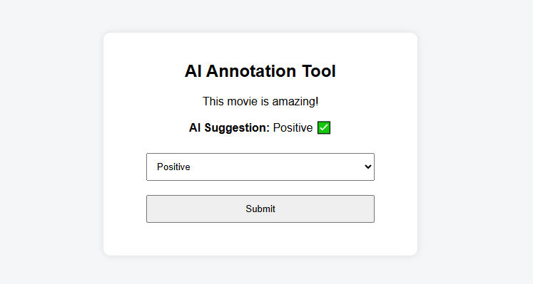

# 🚀 Human Centered AI Data Annotation Platform

GSoC 2026 Proposal Project

---

## 📌 Overview
This project focuses on improving dataset quality using a human-in-the-loop approach combined with AI-assisted annotation. It enables users to label data efficiently while leveraging AI predictions to speed up the process and improve accuracy over time.

---

## 🎯 Features
- ✅ Data annotation interface  
- 🤖 AI-powered label suggestions  
- 🔁 Feedback loop for improving model performance  
- 📊 Future scope: analytics dashboard  

---

## 🛠️ Tech Stack
- Python  
- JavaScript  
- HTML/CSS  
- Flask  
- Machine Learning  

---

## 🚀 Demo UI

---

## ⚙️ Project Structure
